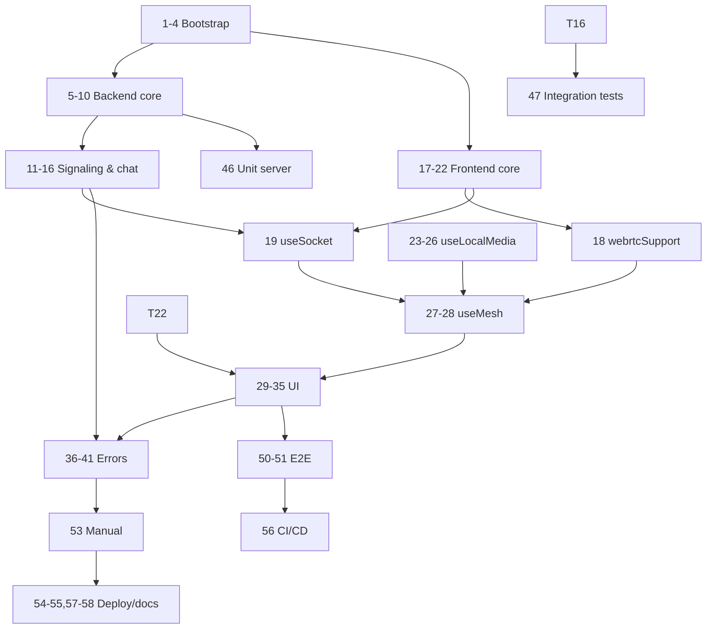

# Implementation Plan — Video Chat Room

|                              |                                                                                                 |
| ---------------------------- | ----------------------------------------------------------------------------------------------- |
| **Документ**   | Implementation Plan (IP)                                                                        |
| **Версия**       | 1.0                                                                                             |
| **Feature-name**       | `video-chat-room`                                                                             |
| **Основание** | PRD «Видеочат-комната» v1.0, TDD`design-video-chat-room.md` v1.0             |
| **Стек**           | Node.js, React, Socket.io, WebRTC (mesh), публичные STUN                               |
| **Принцип**     | Атомарные задачи ≤ 1 рабочий день, зависимости явные |

> Путь сохранения: `prds/video-chat-room/impl-video-chat-room.md`

---

## Обзор фаз

| Фаза                              | Содержание                                                                              | Задачи |
| ------------------------------------- | ------------------------------------------------------------------------------------------------- | ------------ |
| **0. Bootstrap**                | Инициализация репозитория, стек, конфиг, CI                     | 1–4         |
| **1. Backend core**             | RoomRegistry, Room, Participant, валидация, Socket.io bootstrap                          | 5–10        |
| **2. Backend signaling & chat** | Обработчики событий, лимит 4, lifecycle, система сообщений | 11–16       |
| **3. Frontend core**            | Роутинг, стартовый экран, сокет-хук, вход по URL               | 17–22       |
| **4. Frontend media**           | useLocalMedia, useMesh, WebRTC-интеграция                                               | 23–28       |
| **5. Frontend UI**              | VideoGrid, VideoTile, Controls, ChatPanel, Participants, ErrorBanner                              | 29–35       |
| **6. Errors & edge cases**      | WebRTC support, media denial, autoplay, server down, room full                                    | 36–41       |
| **7. Security**                 | Санитайзинг, CSP, rate-limit (опц.), запрет логирования PII        | 42–45       |
| **8. Testing**                  | Unit, integration, E2E, load, ручное                                                        | 46–53       |
| **9. Deploy & docs**            | HTTPS, конфигурация, CI/CD, README, runbook                                           | 54–58       |

---

## Фаза 0. Bootstrap

- [ ] **1. Инициализация репозитория и структуры проекта**

  - Создать monorepo-структуру: `/server`, `/client`, корневой `package.json` с workspaces (или npm/pnpm workspaces).
  - Добавить `.gitignore`, `.editorconfig`, `.nvmrc` (Node 20 LTS).
  - Базовая структура папок согласно TDD §2.2.
  - _Requirements: — ; Design: §2.2_
- [ ] **2. Настройка серверного пакета (Node.js + Express + Socket.io)**

  - `package.json` в `/server`, зависимости: `express`, `socket.io`, `nanoid` (или `crypto`), `dotenv`.
  - Dev-зависимости: `vitest`, `supertest`, `socket.io-client`, `eslint`, `prettier`.
  - Скрипты: `dev`, `start`, `test`, `lint`.
  - _Requirements: F-02, F-04 ; Design: §2.2, §3.3_
- [ ] **3. Настройка клиентского пакета (React + Vite)**

  - `package.json` в `/client`, зависимости: `react`, `react-dom`, `react-router-dom`, `socket.io-client`.
  - Dev-зависимости: `vite`, `@vitejs/plugin-react`, `vitest`, `@testing-library/react`, `playwright`, `eslint`, `prettier`.
  - Скрипты: `dev`, `build`, `preview`, `test`, `e2e`, `lint`.
  - _Requirements: — ; Design: §2.2, §3.1_
- [ ] **4. Базовый CI: lint + unit**

  - GitHub Actions workflow: установка, `lint`, `test` (unit) для обоих пакетов.
  - Кэш node_modules.
  - _Requirements: — ; Design: §12.2_

---

## Фаза 1. Backend core

- [ ] **5. `server/config.js` — единая конфигурация**

  - Переменные: `PORT`, `MAX_PARTICIPANTS=4`, `MAX_NAME_LEN=30`, `MAX_MSG_LEN=1000`, `STUN_URLS`, `NODE_ENV`.
  - Чтение из `process.env` с дефолтами, валидация.
  - _Requirements: F-05, F-38 ; Design: §12.5_
- [ ] **6. `server/util/id.js` — генерация roomId**

  - `generateRoomId()` → URL-safe строка 8–12 символов.
  - Экспорт `ROOM_ID_REGEX = /^[A-Za-z0-9_-]{6,32}$/`.
  - Unit-тесты на формат.
  - _Requirements: F-02 ; Design: §6.4, §10.3_
- [ ] **7. `server/rooms/Participant.js` — модель участника**

  - Фабрика/класс `Participant { id, name, joinedAt, audioEnabled, videoEnabled }`.
  - Дефолты: `audioEnabled=true`, `videoEnabled=true`.
  - _Requirements: F-30 ; Design: §4.3, §5.2_
- [ ] **8. `server/rooms/Room.js` — модель комнаты**

  - Класс `Room` с `id`, `createdAt`, `participants: Map`, `messages: []`.
  - Методы: `add`, `remove`, `isFull`, `peersOf`, `addMessage`.
  - Cap `messages` (см. TBD §5.3 — принять решение: `MAX_MESSAGES_PER_ROOM=500`).
  - Unit-тесты.
  - _Requirements: F-05, F-09, F-14, F-16 ; Design: §4.2, §5.2, §5.3_
- [ ] **9. `server/rooms/RoomRegistry.js` — in-memory реестр**

  - `getOrCreate(roomId)`, `get(roomId)`, `tryJoin(roomId, participant)` (синхронный, атомарный), `leave(roomId, participantId)`.
  - Удаление комнаты при `participants.size === 0`.
  - Unit-тесты: создание один раз, лимит 4, `ROOM_FULL`, удаление.
  - _Requirements: F-05, F-08, F-09 ; Design: §4.1, §5.3, §8.3_
- [ ] **10. `server/index.js` — bootstrap Express + Socket.io**

  - Создание HTTP-сервера, подключение Socket.io, отдача статики React-сборки.
  - SPA-fallback на `index.html` для `/room/:roomId`.
  - Поддержка HTTPS через env (self-signed/dev, reverse-proxy в prod).
  - Health-check эндпоинт `GET /health`.
  - _Requirements: F-04 ; Design: §3.4, §12.1_

---

## Фаза 2. Backend signaling & chat

- [ ] **11. `server/signaling/validate.js` — санитайзинг**

  - `sanitizeName(raw)`: trim, длина 1–30, разрешённые символы (буквы вкл. кириллицу, цифры, пробел, `-`, `_`, `.`).
  - `sanitizeMessage(raw)`: trim, длина ≤ `MAX_MSG_LEN`, отклонение пустых.
  - `isValidRoomId(id)`.
  - Unit-тесты на все кейсы (US-1, US-8).
  - _Requirements: F-38, F-39 ; Design: §10.3_
- [ ] **12. `server/signaling/handlers.js` — `room:join`**

  - Валидация `roomId` и `name` → `room:error INVALID_ROOM/INVALID_NAME`.
  - `registry.tryJoin` → при `ROOM_FULL` отправить `room:error`.
  - При успехе: `socket.join(roomId)`, отправить `room:joined { selfId, participants, history }`, broadcast `room:participant-joined` + системное сообщение остальным.
  - Игнор повторного `room:join` с того же сокета.
  - _Requirements: F-01, F-04, F-05, F-08, F-14, F-16 ; Design: §6.1, §6.2, §7.1, §8.3_
- [ ] **13. `server/signaling/handlers.js` — `signal:offer/answer/ice`**

  - Проброс событий конкретному пиру `to`, добавление поля `from`.
  - Игнор, если `to` не существует в комнате.
  - Проверка, что отправитель и получатель в одной комнате.
  - _Requirements: F-06 ; Design: §6.1, §6.2, §7.2, §8.3_
- [ ] **14. `server/signaling/handlers.js` — `chat:message`**

  - Санитайз, отклонение пустых.
  - Формирование `Message { id, kind:'user', authorId, authorName, text, ts }`.
  - `room.addMessage`, broadcast `chat:message` всем в комнате.
  - Игнор, если сокет не в комнате.
  - _Requirements: F-12, F-13, F-14, F-24 ; Design: §6.1, §6.2, §7.3, §8.3_
- [ ] **15. `server/signaling/handlers.js` — `media:state` + `disconnect` + `room:leave`**

  - `media:state`: обновление `audioEnabled/videoEnabled` участника, broadcast.
  - `room:leave` и `disconnect`: `registry.leave`, broadcast `room:participant-left`, системное сообщение «X покинул комнату», удаление комнаты при 0 участников.
  - _Requirements: F-09, F-15, F-16, F-17, F-18 ; Design: §6.1, §6.2, §7.4, §7.5, §8.3_
- [ ] **16. Регистрация обработчиков и системные сообщения**

  - `registerHandlers(io, socket, registry)` — подключение всех обработчиков.
  - Хелпер `broadcastSystemMessage(room, text)`.
  - Формулировка «X присоединился/покинул комнату» (без «соединение потеряно»).
  - _Requirements: F-15 ; Design: §4.1, §7.5, §8.3_

---

## Фаза 3. Frontend core

- [ ] **17. `client/src/main.jsx` + роутинг**

  - `BrowserRouter`, маршруты `/` → `StartPage`, `/room/:roomId` → `RoomPage`, `*` → редирект на `/`.
  - _Requirements: F-04 ; Design: §2.2, §3.4_
- [ ] **18. `client/src/lib/rtcConfig.js` + `webrtcSupport.js`**

  - `rtcConfig = { iceServers: [{ urls: 'stun:stun.l.google.com:19302' }] }`.
  - `isWebRTCSupported()` — feature-detect `RTCPeerConnection` и `navigator.mediaDevices.getUserMedia`.
  - Unit-тесты.
  - _Requirements: F-36, F-34 ; Design: §4.4, §8.2, §10_
- [ ] **19. `client/src/hooks/useSocket.js` — обёртка Socket.io**

  - Подключение, эмиссия `room:join`, обработка `connect_error`, `room:joined`, `room:error`.
  - Возвращает `{ socket, connected, error, selfId, participants, history }`.
  - Отключение при размонтировании.
  - _Requirements: F-04, F-35 ; Design: §4.4, §6, §8.2_
- [ ] **20. `client/src/pages/StartPage.jsx` + `NameForm.jsx`**

  - Поле имени с валидацией (≤30, разрешённые символы), кнопка «Создать комнату».
  - `generateRoomId()` на клиенте, редирект на `/room/:id`.
  - Состояние ошибки имени (инлайн).
  - _Requirements: F-01, F-02, F-38 ; Design: §4.5, §7.1, §10.3_
- [ ] **21. `client/src/pages/RoomPage.jsx` — обёртка комнаты**

  - Чтение `roomId` из URL, запрос имени (если не задано — простой экран ввода).
  - Оркестрация `useSocket`, `useLocalMedia`, `useMesh`.
  - Layout: `VideoGrid` + `Controls` + `ChatPanel` + `ParticipantsList`.
  - _Requirements: F-04, F-07 ; Design: §4.4, §4.5, §7.1_
- [ ] **22. Кнопка «Скопировать ссылку» (в `Controls`)**

  - `navigator.clipboard.writeText(window.location.href)`.
  - Подтверждение «Ссылка скопирована» (toast/инлайн).
  - Обработка отказа clipboard API (fallback: показать URL в поле).
  - _Requirements: F-03 ; Design: §4.5_

---

## Фаза 4. Frontend media

- [ ] **23. `client/src/hooks/useLocalMedia.js` — базовый getUserMedia**

  - Запрос `getUserMedia({ audio: true, video: true })` при входе.
  - Обработка `NotAllowedError`, `NotFoundError` — установка флагов `audioEnabled=false`/`videoEnabled=false` без вылета.
  - Возвращает `{ stream, audioEnabled, videoEnabled, error }`.
  - _Requirements: F-06, F-13, F-14, F-33 ; Design: §4.4, §7.1, §8.2_
- [ ] **24. `useLocalMedia` — toggle микрофона**

  - `toggleAudio()`: `audioTrack.enabled = !enabled` (для mute достаточно `enabled=false`, чтобы не пересоздавать).
  - Эмиссия `media:state` через колбэк.
  - _Requirements: F-09, F-16 ; Design: §4.4, §7.4_
- [ ] **25. `useLocalMedia` — toggle камеры с освобождением трека**

  - `toggleVideo()` при выключении: `videoTrack.stop()`, `stream.removeTrack`, `sender.replaceTrack(null)` на каждом PC (через колбэк).
  - При включении: новый `getUserMedia({ video: true })`, `addTrack`, `sender.replaceTrack(newTrack)`.
  - Гарантия гашения аппаратного индикатора.
  - _Requirements: F-10, F-18, F-19 ; Design: §4.4, §7.4, §8.2_
- [ ] **26. `useLocalMedia` — обработка потери устройства**

  - Подписка на `videoTrack.onended` / `audioTrack.onended` и `navigator.mediaDevices.ondevicechange`.
  - При потере: сброс соответствующего флага, уведомление UI.
  - _Requirements: F-20 ; Design: §8.2_
- [ ] **27. `client/src/hooks/useMesh.js` — каркас**

  - Хранит `Map<peerId, RTCPeerConnection>` и `Map<peerId, MediaStream>`.
  - Функции: `createPc(peerId)`, `closePc(peerId)`, `closeAll()`.
  - Обработка `pc.ontrack` → обновление `remoteStreams`.
  - Обработка `pc.onicecandidate` → эмиссия `signal:ice`.
  - _Requirements: F-06 ; Design: §4.4, §7.2_
- [ ] **28. `useMesh` — offer/answer + glare-политика**

  - При `room:participant-joined { B }` (для существующих A) — **не** инициировать оффер; ждать оффер от B.
  - При `room:joined { participants }` (для новичка B) — для каждого существующего пира создать PC, `addTrack(localStream)`, `createOffer`, эмиссия `signal:offer`.
  - Обработка входящих `signal:offer` → `setRemoteDescription`, `createAnswer`, эмиссия `signal:answer`.
  - Обработка `signal:answer` → `setRemoteDescription`.
  - Обработка входящих `signal:ice` → `addIceCandidate` (с буферизацией до `setRemoteDescription`).
  - При `room:participant-left` — `closePc(peerId)`.
  - _Requirements: F-06 ; Design: §4.4, §7.2, §8.2 (glare)_

---

## Фаза 5. Frontend UI

- [ ] **29. `client/src/components/VideoTile.jsx`**

  - Props: `{ name, stream, audioEnabled, videoEnabled, isSelf }`.
  - `<video>` с `ref`, `srcObject`, `autoPlay`, `playsInline`, `muted={isSelf}`.
  - Заглушка при `!videoEnabled`: силуэт + имя.
  - Иконка перечёркнутого микрофона при `!audioEnabled`.
  - Имя оверлеем.
  - `React.memo`.
  - _Requirements: F-07, F-08, F-11, F-17, F-18 ; Design: §4.5, §9.3_
- [ ] **30. `client/src/components/VideoGrid.jsx`**

  - Раскладка 1/2/3–4 плиток (CSS Grid, 2×2 для 3–4).
  - Адаптив ≥1024px.
  - Self-view отдельно либо как первая плитка (по решению UX).
  - _Requirements: F-07 ; Design: §4.5, §6_
- [ ] **31. `client/src/components/Controls.jsx`**

  - Кнопки: mic toggle, cam toggle, copy link, leave.
  - Визуальные состояния (on/off).
  - Проброс колбэков.
  - _Requirements: F-03, F-09, F-10, F-17 ; Design: §4.5_
- [ ] **32. `client/src/components/ChatPanel.jsx`**

  - Список сообщений с разбивкой user/system (разные стили).
  - Формат: `HH:MM` (локальное время) + имя + текст.
  - Рендер как plain text (React-экранирование).
  - Автоскролл к низу при новом сообщении (через `ref`).
  - Поле ввода, кнопка disabled при пустом/пробельном.
  - _Requirements: F-12, F-13, F-14, F-24, F-39 ; Design: §4.5, §7.3, §7.6, §10.4_
- [ ] **33. `client/src/components/ParticipantsList.jsx`**

  - Актуальный список участников из состояния `RoomPage`.
  - _Requirements: F-16 ; Design: §4.5, §6.2_
- [ ] **34. `client/src/components/ErrorBanner.jsx` + интеграция**

  - Props: `{ kind, message, onRetry? }`.
  - Виды: `SERVER_DOWN`, `WEBRTC_UNSUPPORTED`, `MEDIA_DENIED`, `ROOM_FULL`.
  - Кнопка «Повторить» для `SERVER_DOWN` / `ROOM_FULL`.
  - _Requirements: F-33, F-35, F-36 ; Design: §4.5, §8.1, §8.2_
- [ ] **35. Layout и стили комнаты (CSS)**

  - Двухколоночный layout: video grid + sidebar (chat + participants).
  - Читаемость, контраст, очевидность кнопок.
  - Адаптив от 1024px.
  - _Requirements: F-07 ; Design: §6, §4.5_

---

## Фаза 6. Errors & edge cases

- [ ] **36. Обработка «Сервер недоступен» на клиенте**

  - Перехват `socket.on('connect_error')` → `ErrorBanner SERVER_DOWN` с кнопкой «Повторить».
  - _Requirements: F-35 ; Design: §8.2_
- [ ] **37. Обработка «WebRTC не поддерживается»**

  - Проверка при монтировании `StartPage` / `RoomPage`, блокировка UI с сообщением.
  - _Requirements: F-36 ; Design: §8.2_
- [ ] **38. Обработка отказа в доступе к медиа**

  - `NotAllowedError` / `NotFoundError` → `ErrorBanner MEDIA_DENIED`, участник остаётся в комнате, соответствующие устройства выключены.
  - _Requirements: F-33, F-14 ; Design: §8.2_
- [ ] **39. Обработка autoplay-блокировки**

  - Перехват rejected `video.play()`.
  - Кнопка «Включить звук» — по клику вызвать `play()` для всех удалённых потоков.
  - _Requirements: F-37 ; Design: §8.2_
- [ ] **40. Экран «Комната заполнена»**

  - Перехват `room:error { code: 'ROOM_FULL' }` → экран с сообщением и кнопкой «Повторить вход» (возврат к вводу имени).
  - _Requirements: F-08 ; Design: §8.1_
- [ ] **41. Обработка позднего входа (история чата)**

  - В `RoomPage` инициализация `messages` из `room:joined.history` до подписки на новые `chat:message`.
  - _Requirements: F-14 ; Design: §7.6_

---

## Фаза 7. Security

- [ ] **42. Санитайзинг на сервере (финализация)**

  - Убедиться, что все входящие поля (`name`, `text`, `roomId`) проходят через `validate.js` во всех обработчиках.
  - _Requirements: F-38, F-39 ; Design: §10.3, §10.4_
- [ ] **43. Запрет `dangerouslySetInnerHTML`**

  - Проверка/линт-правило на клиенте.
  - Ревью рендера сообщений и имён — только через React-экранирование.
  - _Requirements: F-39 ; Design: §10.4_
- [ ] **44. Security headers + CSP**

  - Middleware: `X-Content-Type-Options: nosniff`, `Referrer-Policy: no-referrer`, CSP.
  - CSP: `default-src 'self'; connect-src 'self' wss:; media-src 'self' blob:;` (уточнить dev/prod).
  - _Requirements: — ; Design: §10.7_
- [ ] **45. Отключение логирования PII**

  - Проверить, что SDP/ICE/имена/текст сообщений не попадают в логи.
  - Логировать только метаданные (событие, roomId hash, длительности).
  - _Requirements: — ; Design: §10.5_

---

## Фаза 8. Testing

- [ ] **46. Unit-тесты сервера**

  - `RoomRegistry`, `Room`, `Participant`, `validate`, `generateRoomId`.
  - Покрытие ≥80%.
  - _Requirements: F-05, F-38 ; Design: §11.1, §11.6_
- [ ] **47. Integration-тесты сервера (Socket.io)**

  - Реальный инстанс Socket.io на случайном порту + `socket.io-client`.
  - Сценарии: 2 клиента в комнате, 5-й — `ROOM_FULL`, гонка (3+2), выход последнего — удаление, поздний вход — `history`, XSS в имени/сообщении.
  - _Requirements: F-05, F-08, F-09, F-14, F-39 ; Design: §11.2_
- [ ] **48. Unit-тесты клиента (утилиты и хуки)**

  - `isWebRTCSupported`, `rtcConfig`, `useLocalMedia` (с моками `getUserMedia`), `useSocket` (с мок-сокетом).
  - Покрытие ≥60%.
  - _Requirements: — ; Design: §11.1, §11.6_
- [ ] **49. E2E Playwright — setup**

  - Конфигурация с fake media флагами (`--use-fake-device-for-media-stream`, `--use-fake-ui-for-media-stream`).
  - Запуск сервера + клиента в CI.
  - _Requirements: — ; Design: §11.3_
- [ ] **50. E2E — базовые сценарии**

  - Создание комнаты → редирект → self-view.
  - Два браузера: оба видят друг друга, чат работает.
  - 4 браузера: сетка 2×2.
  - _Requirements: US-2, US-6, US-8 ; Design: §11.3_
- [ ] **51. E2E — edge cases**

  - 5-й участник → «Комната заполнена».
  - Toggle mic/cam → иконки, заглушка.
  - Выход → плитка исчезает, системное сообщение.
  - Обрыв (закрытие контекста) → участник удалён.
  - Мок `getUserMedia` reject → баннер, участник в комнате.
  - Мок `window.RTCPeerConnection = undefined` → баннер.
  - _Requirements: US-5, US-7, US-10, US-11, US-12, US-13 ; Design: §11.3_
- [ ] **52. Load-тест signaling + chat**

  - k6/artillery: N комнат × 4 сокета, замер `room:joined` p95, потребление памяти при 100/500/1000 комнат.
  - Зафиксировать результат как baseline (в т.ч. ответ на TBD §9.1).
  - _Requirements: — ; Design: §11.4, §9.1_
- [ ] **53. Ручное тестирование на реальных устройствах**

  - Chrome/Firefox/Edge, реальные камера/микрофон.
  - Проверка гашения аппаратного индикатора камеры.
  - Проверка autoplay-политики.
  - Проверка без TURN (симметричный NAT) — допустимый fail.
  - Чеклист в `docs/manual-testing.md`.
  - _Requirements: F-19, F-37, F-34 ; Design: §11.5_

---

## Фаза 9. Deploy & docs

- [ ] **54. HTTPS-конфигурация и dev-режим**

  - Dev: localhost (без TLS).
  - Staging/Prod: инструкция по reverse-proxy (nginx) с TLS + WSS.
  - Поддержка self-signed сертификата для локального HTTPS-теста.
  - _Requirements: — ; Design: §12.1_
- [ ] **55. Production-сборка и раздача статики**

  - `client build` → `/server/public`.
  - Express отдаёт статику, SPA-fallback.
  - Проверка, что путь `/room/:id` корректно отдаёт SPA.
  - _Requirements: F-04 ; Design: §3.4, §12.1_
- [ ] **56. CI/CD — расширение pipeline**

  - Добавить `build` клиента и `e2e` (Playwright) в CI.
  - Артефакты сборки, шаг deploy на staging (manual approval).
  - _Requirements: — ; Design: §12.2_
- [ ] **57. README + runbook**

  - Локальный запуск, переменные окружения (см. TDD §12.5), запуск тестов, деплой.
  - Раздел troubleshooting (STUN, autoplay, media permissions).
  - _Requirements: — ; Design: §12_
- [ ] **58. Rollback-процедура**

  - Инструкция отката сборки статики и образа Node.
  - Подтверждение отсутствия миграций (нет БД, нет клиентского хранилища).
  - _Requirements: — ; Design: §12.4, §12.6_

---

## Карта зависимостей (критический путь)

**Правила зависимостей (кратко):**

| Задача               | Должна быть после |
| -------------------------- | -------------------------------- |
| 5–10 (Backend core)       | 1–4                             |
| 11–16 (Signaling)         | 5–10                            |
| 17–22 (FE core)           | 1–4                             |
| 18 (`webrtcSupport`)     | 17                               |
| 19 (`useSocket`)         | 11, 17                           |
| 23–26 (`useLocalMedia`) | 17                               |
| 27–28 (`useMesh`)       | 18, 19, 23                       |
| 29–35 (UI)                | 22, 27                           |
| 36–41 (Errors)            | 11, 29                           |
| 42–45 (Security)          | 11, 32                           |
| 46 (Unit server)           | 5–10                            |
| 47 (Integration)           | 16                               |
| 48 (Unit client)           | 18, 19, 23, 27                   |
| 49–51 (E2E)               | 29, 36–41                       |
| 52 (Load)                  | 16                               |
| 53 (Manual)                | 36–41                           |
| 54–58 (Deploy/docs)       | 50, 53                           |

---

## Открытые вопросы (перенос из TDD §14)

| #  | Вопрос                                                            | Задача, где закрывается                                          |
| -- | ----------------------------------------------------------------------- | ------------------------------------------------------------------------------------ |
| 1  | Где генерируется`roomId` — клиент/сервер? | 6, 20 (предложение: клиент + серверная валидация) |
| 2  | Cap на`room.messages`?                                              | 8 (предложение:`MAX_MESSAGES_PER_ROOM=500`)                             |
| 3  | Rate-limit на`chat:message` / `signal:*`?                         | 44 (опционально; вне Must-скоупа)                                |
| 4  | Различать одинаковые имена в UI?               | 29, 33 (предложение: не различать, PRD допускает)     |
| 5  | Таймаут детекта «STUN/PC не подключился»?  | 27 (предложение: 10 с)                                                   |
| 6  | Число одновременных комнат на инстанс? | 52 (по результатам load-теста)                                     |
| 7  | Формат ответа на`INVALID_MESSAGE`?                      | 14 (предложение: игнор на клиенте)                          |
| 8  | Нужен ли`room:participants` снапшот?                    | 16 (предложение: достаточно инкрементальных)     |
| 9  | CSP-политика dev/prod?                                          | 44                                                                                   |
| 10 | Хостинг STUN — только Google?                             | 18, 54 (только Google, по PRD)                                               |
| 11 | Метрики/трейсинг?                                        | Вне scope                                                                         |
| 12 | Логирование PII?                                             | 45                                                                                   |

---

## Оценка трудозатрат (ориентировочно)

| Фаза             | Задач   | Дней (оценка) |
| -------------------- | ------------ | ----------------------- |
| 0. Bootstrap         | 4            | 2                       |
| 1. Backend core      | 6            | 4                       |
| 2. Signaling & chat  | 6            | 4                       |
| 3. FE core           | 6            | 4                       |
| 4. FE media          | 6            | 5                       |
| 5. FE UI             | 7            | 4                       |
| 6. Errors            | 6            | 3                       |
| 7. Security          | 4            | 2                       |
| 8. Testing           | 8            | 8                       |
| 9. Deploy & docs     | 5            | 3                       |
| **Итого** | **58** | **~39 дней**  |

> Оценка одного разработчика full-stack. При параллельной работе FE/BE возможно сокращение до ~5–6 недель.

---

*Конец документа.*
