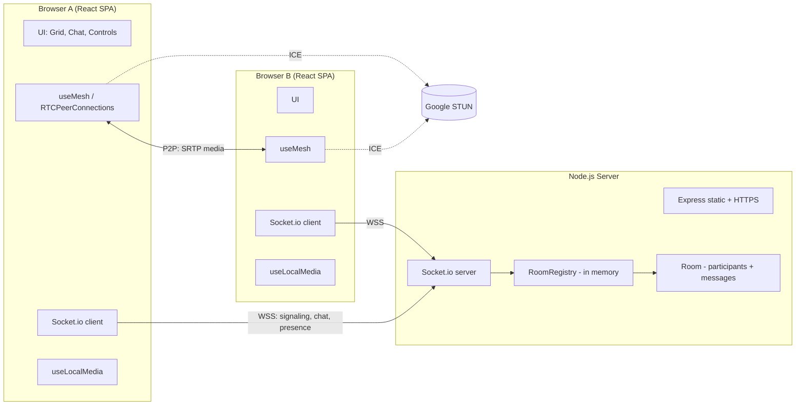
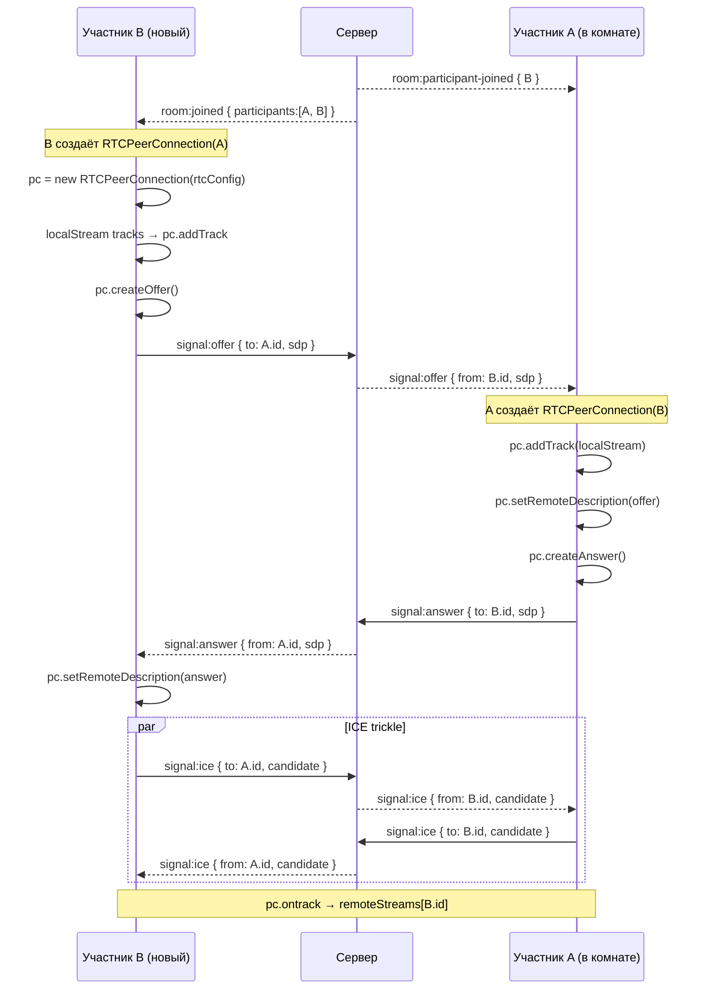
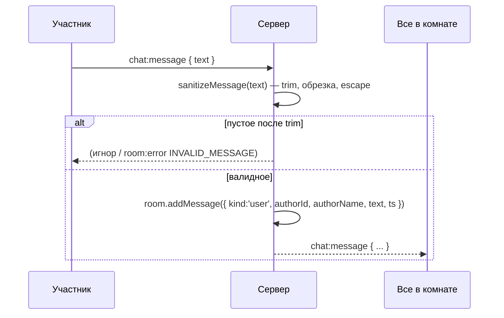
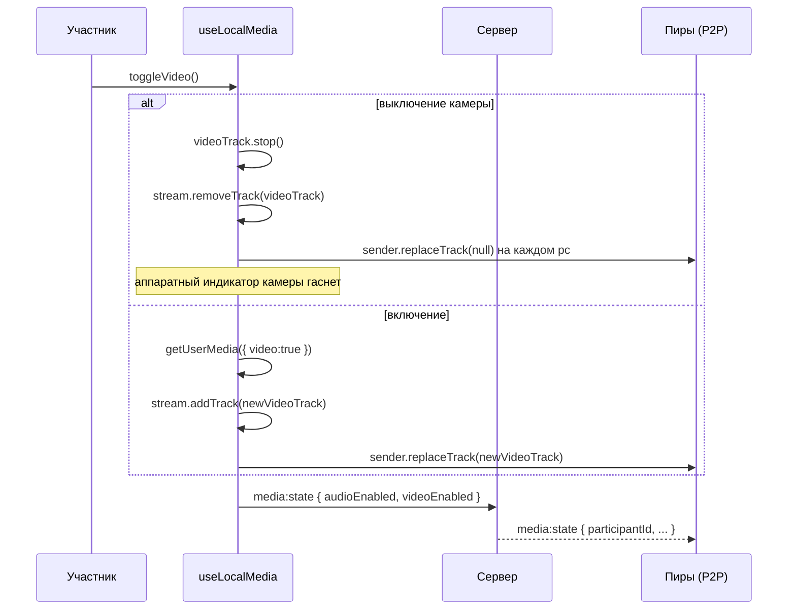
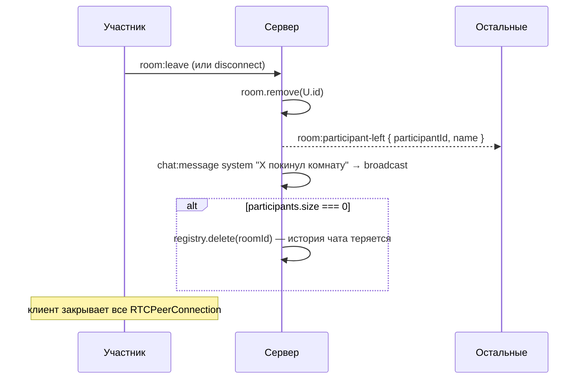
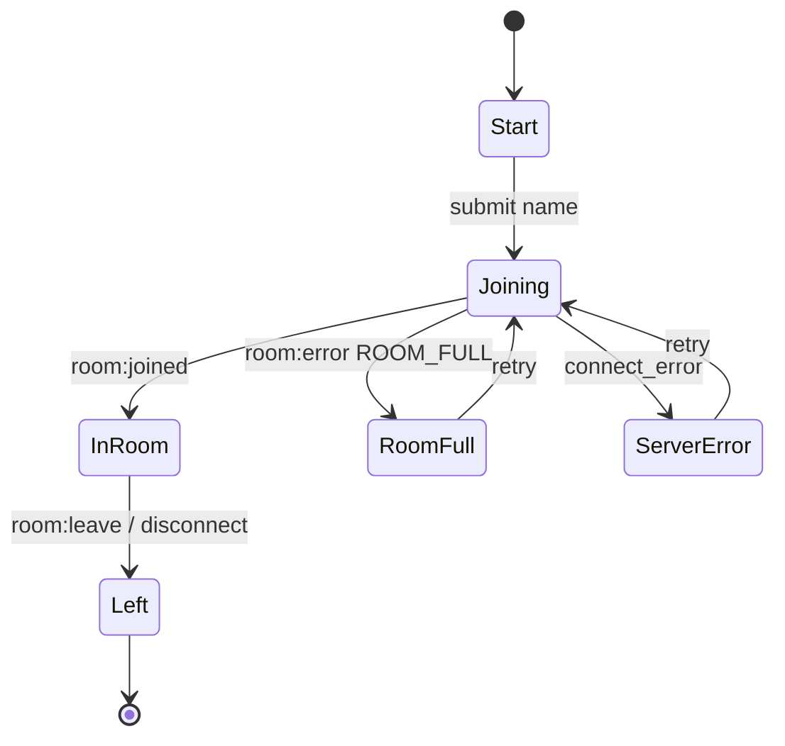

# Technical Design Document — Video Chat Room

|                                         |                                                                           |
| --------------------------------------- | ------------------------------------------------------------------------- |
| **Документ**              | Technical Design Document (TDD)                                           |
| **Версия**                  | 1.0                                                                       |
| **Feature-name**                  | `video-chat-room`                                                       |
| **Основание**            | PRD «Видеочат-комната» v1.0 (`Fora_Soft_PRD_final.md`) |
| **Стек**                      | Node.js, React, Socket.io, WebRTC (mesh), публичные STUN         |
| **Язык интерфейса** | русский                                                            |
| **Статус**                  | Draft                                                                     |

---

## 1. Overview / Контекст

### 1.1 Цель фичи

Реализовать веб-приложение группового видеочата на **до 4 участников** в одной комнате с:

- аудио/видео в реальном времени (WebRTC, топология mesh);
- общим текстовым чатом и системными событиями (Socket.io);
- приглашением по ссылке без регистрации;
- управлением микрофоном/камерой и корректной обработкой сбоев.

### 1.2 Ссылка на PRD

Источник требований — PRD «Видеочат-комната» v1.0. Все функциональные требования (F-01…F-18) и User Stories (US-1…US-13) трассируются в разделы 4 и 8 данного TDD.

### 1.3 Ключевые ограничения (из PRD §7)

| Ограничение                  | Значение                                                          |
| --------------------------------------- | ------------------------------------------------------------------------- |
| Топология медиа           | WebRTC mesh (P2P full-mesh)                                               |
| Лимит участников         | 4 (жёстко, атомарная проверка на сервере) |
| Сигналинг                      | Socket.io (Node.js)                                                       |
| ICE                                     | только публичные Google STUN,**без TURN**         |
| Состояние комнат         | только в памяти сервера, без БД                  |
| Клиентское хранилище | запрещено (localStorage/sessionStorage/IndexedDB)                |
| Авторизация                  | отсутствует                                                    |
| Автопереподключение  | отсутствует                                                    |
| Транспорт                      | HTTPS/WSS обязателен                                            |
| Браузеры                        | Chrome/Firefox/Edge 100+, десктоп ≥ 1024px                        |
| Задержка медиа             | ≤ 500 мс в локальной сети                                |

### 1.4 Что НЕ входит (см. PRD §5)

Аутентификация, модерация, TURN, E2E-шифрование сверх DTLS-SRTP, запись, screen sharing, файлы в чате, i18n, мобильная адаптация, звуковые уведомления.

---

## 2. Current Architecture & Codebase Summary

### 2.1 Состояние репозитория

> ⚠️ **TBD:** на момент написания TDD доступ к репозиторию не предоставлен. Предполагается «greenfield»-проект (новый репозиторий под тест-задание). Если в репозитории уже есть код, раздел 2.2 необходимо заполнить по факту просмотра.

Раздел описывает **целевую структуру** нового проекта, которая будет создана в рамках этой фичи. Это одновременно и «сводка файлов», которую обычно получают из существующего кода.

### 2.2 Предполагаемая структура файлов (to be created)

#### Сервер (`/server`)

| Путь                         | Класс / функция                | Назначение                                                                                                                             |
| -------------------------------- | ------------------------------------------ | ------------------------------------------------------------------------------------------------------------------------------------------------ |
| `server/index.js`              | `bootstrap()`                            | Инициализация Express + HTTP + Socket.io, HTTPS-конфиг, CORS                                                                  |
| `server/config.js`             | `config`                                 | Порты, ICE-серверы (STUN), лимиты (MAX_PARTICIPANTS=4, MAX_NAME_LEN=30, MAX_MSG_LEN)                                           |
| `server/rooms/RoomRegistry.js` | `RoomRegistry`                           | In-memory реестр комнат:`getOrCreate`, `delete`, `has`, атомарный `tryJoin`                                         |
| `server/rooms/Room.js`         | `Room`                                   | Модель комнаты:`id`, `participants: Map<socketId, Participant>`, `messages: Message[]`, методы `add/remove/broadcast` |
| `server/rooms/Participant.js`  | `Participant`                            | `id` (socket.id или UUID), `name`, `joinedAt`, media-флаги                                                                         |
| `server/signaling/handlers.js` | `registerHandlers(io, socket, registry)` | Обработчики`room:join`, `signal:offer/answer/ice`, `chat:message`, `media:toggle`, `disconnect`                             |
| `server/signaling/validate.js` | `sanitizeName`, `sanitizeMessage`      | Валидация имени (≤30, без спецсимволов) и сообщения (непустое, обрезка)                   |
| `server/util/id.js`            | `generateRoomId()`                       | Генерация ID комнаты (например,`nanoid`/`crypto.randomUUID`)                                                         |

#### Клиент (`/client`)

| Путь                                       | Компонент / функция | Назначение                                                          |
| ---------------------------------------------- | ----------------------------------- | ----------------------------------------------------------------------------- |
| `client/src/main.jsx`                        | `App`                             | Роутинг:`/` → Start, `/room/:roomId` → Room                      |
| `client/src/pages/StartPage.jsx`             | `StartPage`                       | Форма имени + «Создать комнату»                     |
| `client/src/pages/RoomPage.jsx`              | `RoomPage`                        | Обёртка комнаты (имя, сокет, WebRTC)                    |
| `client/src/components/NameForm.jsx`         | `NameForm`                        | Валидация имени (≤30, regex)                                   |
| `client/src/components/VideoGrid.jsx`        | `VideoGrid`                       | Адаптивная сетка 1–4 плиток                             |
| `client/src/components/VideoTile.jsx`        | `VideoTile`                       | Плитка: видео/заглушка, имя, иконки mute/cam-off  |
| `client/src/components/Controls.jsx`         | `Controls`                        | Кнопки mic/cam/leave/copy-link                                          |
| `client/src/components/ChatPanel.jsx`        | `ChatPanel`                       | Список сообщений + ввод, автоскролл              |
| `client/src/components/ParticipantsList.jsx` | `ParticipantsList`                | Актуальный состав комнаты                              |
| `client/src/components/ErrorBanner.jsx`      | `ErrorBanner`                     | Сообщения об ошибках (server down, WebRTC, room full)       |
| `client/src/hooks/useSocket.js`              | `useSocket`                       | Обёртка Socket.io-клиента                                       |
| `client/src/hooks/useLocalMedia.js`          | `useLocalMedia`                   | `getUserMedia`, toggle mic/cam, освобождение трека         |
| `client/src/hooks/useMesh.js`                | `useMesh`                         | Управление RTCPeerConnections (per-peer map)                        |
| `client/src/lib/rtcConfig.js`                | `rtcConfig`                       | `{ iceServers: [{ urls: 'stun:stun.l.google.com:19302' }] }`                |
| `client/src/lib/webrtcSupport.js`            | `isWebRTCSupported()`             | Feature-detect                                                                |
| `client/src/lib/escape.js`                   | `escapeHtml()`                    | XSS-защита (если не полагаемся только на React) |

### 2.3 Ключевые находки

- Backend stateless по данным (БД нет) → вся логика комнаты в памяти процесса; горизонтальное масштабирование не предусмотрено (см. §9).
- Клиент не использует постоянное хранилище → имя и ID комнаты живут в React-состоянии и URL.
- WebRTC mesh даёт квадратичный рост соединений (для N=4 — 6 PC на комнату, 3 исходящих потока с клиента).

---

## 3. Proposed Architecture / High-Level Design

### 3.1 Компонентная схема



### 3.2 Топология медиа (mesh)

- Для N участников — `N*(N-1)/2` пар. При N=4: **6 RTCPeerConnection** на комнату, **3 исходящих потока** с каждого клиента (по одному на каждого другого).
- Каждый клиент самостоятельно инициирует/принимает офферы для каждого пира. Единая политика: **«кто вошёл позже — тот инициирует оффер»** (см. §7.2) во избежание glare (collision офферов).
- Аудио/видео — SRTP (штатное шифрование WebRTC), через STUN устанавливается соединение; при строгом симметричном NAT соединение с отдельным пиром может не установиться (TURN отсутствует — допустимо по PRD).

### 3.3 Роли сервера

- **Signaling relay:** пересылает SDP/ICE между участниками одной комнаты.
- **Presence & chat:** рассылает `room:participants`, `chat:message`, системные события.
- **Admission control:** атомарная проверка лимита 4 при `room:join`.
- **Lifecycle:** создание/удаление комнаты, удаление при `disconnect` последнего участника.

### 3.4 Роутинг и HTTPS

- SPA отдаётся Express. HTTPS обязателен (кроме localhost). При деплое — reverse-proxy (nginx) с TLS, либо self-signed на dev.
- Путь `/room/:roomId` → клиентский роут. При прямом открытии ссылки сервер отдаёт тот же SPA (fallback на `index.html`).

---

## 4. Components & Interfaces

### 4.1 Server: `RoomRegistry`

**Ответственность:** единая точка создания/поиска/удаления комнат; атомарный контроль лимита.

```ts
interface RoomRegistry {
  getOrCreate(roomId: string): Room;
  get(roomId: string): Room | undefined;
  tryJoin(roomId: string, participant: Participant): JoinResult; // атомарно проверяет лимит
  leave(roomId: string, participantId: string): void;             // удаляет комнату, если пусто
}

type JoinResult =
  | { ok: true; room: Room }
  | { ok: false; reason: 'ROOM_FULL' };
```

> Атомарность в Node.js обеспечивается тем, что проверка и добавление выполняются **синхронно** в одном tick (single-threaded event loop) без `await` между проверкой и вставкой. Это ключевой приём для US-5 (гонка за последний слот).

### 4.2 Server: `Room`

```ts
class Room {
  id: string;
  participants: Map<string, Participant>; // socketId -> Participant
  messages: Message[];                    // история за время жизни комнаты
  createdAt: number;

  add(p: Participant): void;
  remove(id: string): void;
  isFull(): boolean;                      // participants.size >= MAX_PARTICIPANTS
  peersOf(id: string): string[];          // все, кроме id
  addMessage(m: Message): void;
}
```

### 4.3 Server: `Participant`

```ts
interface Participant {
  id: string;            // = socket.id (или UUID), не отображается в UI
  name: string;          // ≤30, провалидировано
  joinedAt: number;
  audioEnabled: boolean; // по умолчанию true
  videoEnabled: boolean; // по умолчанию true
}
```

### 4.4 Client hooks

| Hook                                    | Ответственность                                                                                        | Возвращает                                                        |
| --------------------------------------- | --------------------------------------------------------------------------------------------------------------------- | --------------------------------------------------------------------------- |
| `useSocket(roomId, name)`             | Подключение, эмиссия`room:join`, обработка серверных событий             | `{ connected, error, socket }`                                            |
| `useLocalMedia()`                     | `getUserMedia({audio,video})`, toggle mic/cam, освобождение дорожки                              | `{ stream, audioEnabled, videoEnabled, toggleAudio, toggleVideo, error }` |
| `useMesh(socket, localStream, peers)` | Создание/закрытие RTCPeerConnection на каждого пира, обработка offer/answer/ICE | `{ remoteStreams: Map<peerId, MediaStream> }`                             |

### 4.5 UI-компоненты

| Компонент   | Входы                                                         | Поведение                                                                                                     |
| -------------------- | ------------------------------------------------------------------ | ---------------------------------------------------------------------------------------------------------------------- |
| `VideoGrid`        | `tiles: TileData[]`                                              | Раскладка 1/2/3–4 плитки (2×2), адаптив ≥1024px                                               |
| `VideoTile`        | `{ name, stream, audioEnabled, videoEnabled, isSelf }`           | Видео или заглушка (силуэт + имя); иконка mute; имя оверлеем                 |
| `Controls`         | `{ audioEnabled, videoEnabled, onToggle*, onLeave, onCopyLink }` | Кнопки + подтверждение копирования                                                       |
| `ChatPanel`        | `{ messages, onSend }`                                           | Автоскролл; рендер name + HH:MM; системные сообщения отдельным стилем |
| `ParticipantsList` | `{ participants }`                                               | Актуальный список (обновляется по серверному событию)                    |
| `ErrorBanner`      | `{ kind, message, onRetry? }`                                    | ROOM_FULL / SERVER_DOWN / WEBRTC_UNSUPPORTED / MEDIA_DENIED                                                            |

---

## 5. Data Model & DB Changes

### 5.1 БД

**Не используется.** По PRD §7 состояние комнат — только в памяти. Миграции отсутствуют.

### 5.2 In-memory модель

```
RoomRegistry
  rooms: Map<roomId: string, Room>

Room
  id: string
  createdAt: number
  participants: Map<socketId: string, Participant>
  messages: Message[]

Participant
  id: string
  name: string
  joinedAt: number
  audioEnabled: boolean
  videoEnabled: boolean

Message
  id: string                 // для дедупликации на клиенте (опционально)
  kind: 'user' | 'system'
  authorId?: string          // для kind='user'
  authorName?: string        // снапшот имени на момент отправки
  text: string
  ts: number                 // серверное UTC; клиент форматирует в HH:MM local
```

### 5.3 Жизненный цикл данных

| Событие                                           | Действие                                                                                                                         |
| -------------------------------------------------------- | ---------------------------------------------------------------------------------------------------------------------------------------- |
| Первый`room:join` с новым `roomId`       | `getOrCreate` создаёт `Room`                                                                                                  |
| `room:join` в существующую                | `tryJoin` (лимит 4)                                                                                                               |
| `chat:message`                                         | push в`room.messages` (в памяти)                                                                                               |
| `disconnect` / `room:leave`                          | `remove(participant)`; если `participants.size === 0` → `registry.delete(roomId)` — история чата теряется |
| Повторный вход по тому же`roomId` | Создаётся новая пустая комната (US-10, F-09)                                                                  |

> **TBD:** нужен ли лимит на длину `room.messages` (защита от утечки памяти при длинной сессии)? Предложение: `MAX_MESSAGES_PER_ROOM = 500`, при превышении — обрезать старейшие. Требует подтверждения.

---

## 6. API / Contracts

Транспорт — **Socket.io** (поверх WSS). REST-эндпоинтов, кроме отдачи статики, нет.

### 6.1 Клиент → Сервер

| Event             | Payload                                              | Описание                                                                 |
| ----------------- | ---------------------------------------------------- | -------------------------------------------------------------------------------- |
| `room:join`     | `{ roomId: string, name: string }`                 | Вход в комнату; валидация имени и лимита        |
| `signal:offer`  | `{ to: string, sdp: RTCSessionDescriptionInit }`   | Пересылка оффера конкретному пиру                  |
| `signal:answer` | `{ to: string, sdp: RTCSessionDescriptionInit }`   | Пересылка ответа                                                  |
| `signal:ice`    | `{ to: string, candidate: RTCIceCandidateInit }`   | Пересылка ICE-кандидата                                        |
| `chat:message`  | `{ text: string }`                                 | Отправка сообщения в общий чат                         |
| `media:state`   | `{ audioEnabled: boolean, videoEnabled: boolean }` | Уведомление об изменении статуса устройств |
| `room:leave`    | `{}`                                               | Явный выход (кнопка «Выйти»)                              |

### 6.2 Сервер → Клиент

| Event                       | Payload                                                         | Описание                                                                                               |
| --------------------------- | --------------------------------------------------------------- | -------------------------------------------------------------------------------------------------------------- |
| `room:joined`             | `{ selfId, participants: Participant[], history: Message[] }` | Успешный вход: свой id, текущий состав, история чата                   |
| `room:error`              | `{ code: 'ROOM_FULL' \| 'INVALID_NAME' \| 'INVALID_ROOM' }`     | Отказ во входе                                                                                     |
| `room:participant-joined` | `{ participant: Participant }`                                | Новый участник                                                                                    |
| `room:participant-left`   | `{ participantId: string, name: string }`                     | Участник вышел/оборвался                                                                 |
| `room:participants`       | `{ participants: Participant[] }`                             | Полный снапшот состава (на всякий случай; можно опционально) |
| `signal:offer`            | `{ from: string, sdp }`                                       | Входящий оффер                                                                                    |
| `signal:answer`           | `{ from: string, sdp }`                                       | Входящий ответ                                                                                    |
| `signal:ice`              | `{ from: string, candidate }`                                 | Входящий ICE-кандидат                                                                          |
| `chat:message`            | `Message`                                                     | Новое сообщение (user или system)                                                             |
| `media:state`             | `{ participantId: string, audioEnabled, videoEnabled }`       | Статус устройств участника                                                             |

### 6.3 Примеры полезной нагрузки

**`room:join` (запрос):**

```json
{ "roomId": "a1b2c3d4", "name": "Алекс" }
```

**`room:joined` (ответ):**

```json
{
  "selfId": "sock_7f3a",
  "participants": [
    { "id": "sock_7f3a", "name": "Алекс", "audioEnabled": true, "videoEnabled": true },
    { "id": "sock_91bc", "name": "Мария", "audioEnabled": false, "videoEnabled": true }
  ],
  "history": [
    { "id": "m1", "kind": "system", "text": "Мария присоединилась к комнате", "ts": 1718000000000 },
    { "id": "m2", "kind": "user", "authorId": "sock_91bc", "authorName": "Мария", "text": "Привет!", "ts": 1718000010000 }
  ]
}
```

**`room:error`:**

```json
{ "code": "ROOM_FULL" }
```

**`chat:message` (broadcast):**

```json
{
  "id": "m3",
  "kind": "user",
  "authorId": "sock_7f3a",
  "authorName": "Алекс",
  "text": "Ссылка: https://...",
  "ts": 1718000020000
}
```

### 6.4 Семантика ID

- `roomId` — генерируется на клиенте при создании комнаты (либо на сервере — см. Open Questions). Формат: URL-safe, 8–12 символов (`nanoid`/`crypto.randomUUID().slice`).
- `participant.id` — `socket.id` (уникален в рамках подключения). Не отображается в UI (PRD F-30).

---

## 7. Data & Control Flows

### 7.1 Создание комнаты

```mermaid
sequenceDiagram
  participant U as Пользователь
  participant SPA as React SPA
  participant SRV as Node + Socket.io

  U->>SPA: Вводит имя, жмёт "Создать комнату"
  SPA->>SPA: Валидация имени (≤30, regex)
  SPA->>SPA: generateRoomId()
  SPA->>SPA: navigate(`/room/${roomId}`)
  SPA->>SRV: connect WSS
  SPA->>SRV: emit room:join { roomId, name }
  SRV->>SRV: registry.getOrCreate(roomId); tryJoin
  SRV-->>SPA: room:joined { selfId, participants:[self], history:[] }
  SPA->>SRV: emit media:state { audioEnabled:true, videoEnabled:true }
  SPA->>SPA: getUserMedia → local preview
```

### 7.2 Установление mesh-соединения (вход 2-го участника)

Политика: **инициатор оффера — вновь вошедший** (у него ещё нет PC ни с кем). Существующие участники только отвечают.



**Правило glare:** оффер инициирует только вновь вошедший. Существующие участники никогда не создают оффер к новичку — только отвечают. Это исключает коллизию.

### 7.3 Отправка сообщения в чат



### 7.4 Toggle микрофона/камеры



### 7.5 Выход и удаление комнаты



### 7.6 Поздний вход — история чата

При `room:join` сервер возвращает `history` (все `Message` из `room.messages`) в `room:joined`. Клиент отрисовывает их в `ChatPanel` до подписки на новые `chat:message`.

---

## 8. Error Handling & Edge Cases

### 8.1 Коды ошибок (Socket.io `room:error`)

| Код              | Условие                                                                                  | UI-реакция                                                                               |
| ------------------- | ----------------------------------------------------------------------------------------------- | ----------------------------------------------------------------------------------------------- |
| `ROOM_FULL`       | `tryJoin` вернул `ok:false`, т.к. 4 участника                              | Экран «Комната заполнена» + кнопка «Повторить вход» |
| `INVALID_NAME`    | Имя пустое / >30 / запрещённые символы после санитайза | Инлайн-подсказка у поля имени                                          |
| `INVALID_ROOM`    | `roomId` отсутствует / не строка / не URL-safe                           | Редирект на`/`                                                                      |
| `INVALID_MESSAGE` | Пустое/пробельное сообщение (опционально)                   | Игнор на клиенте (кнопка disabled)                                          |

### 8.2 Клиентские ошибки

| Ситуация                                                                                                | Обработка                                                                                                                                                                                                                                                                        |
| --------------------------------------------------------------------------------------------------------------- | ----------------------------------------------------------------------------------------------------------------------------------------------------------------------------------------------------------------------------------------------------------------------------------------- |
| **Сервер недоступен** (socket `connect_error`)                                          | `ErrorBanner` «Не удалось подключиться к серверу», кнопка «Повторить»                                                                                                                                                                   |
| **WebRTC не поддерживается**                                                              | Feature-detect (`RTCPeerConnection` в `window`) → `ErrorBanner` «WebRTC не поддерживается»                                                                                                                                                                      |
| **Отказ в доступе к камере/микрофону** (`NotAllowedError`)                 | `ErrorBanner` «Нет доступа к камере/микрофону». Участник остаётся в комнате; соответствующие устройства выключены                                                                                 |
| **Нет физических устройств** (`NotFoundError`)                                    | Участник входит; устройства выключены; плитка с заглушкой                                                                                                                                                                                |
| **Потеря устройства во время звонка** (`track.onended` / `devicechange`) | Соответствующий поток прекращается; UI показывает выключенное устройство; восстановление — через настройки браузера/ОС                                                              |
| **Autoplay заблокирован** (`play()` rejected)                                               | Показать кнопку «Включить звук»; по клику —`audio.play()` для всех удалённых потоков                                                                                                                                         |
| **Обрыв соединения участника**                                                    | Сервер удаляет его по`disconnect`; остальные получают `room:participant-left`; системное сообщение «X покинул комнату» (без «соединение потеряно»)                                        |
| **STUN недоступен**                                                                             | WebRTC может не собрать srflx-кандидатов; PC зависает в`connecting`. Таймаут-детект (например, 10 с) → пометить пира как недоступного; звонок с остальными продолжается |
| **Glare (одновременные офферы)**                                                       | Не возникает благодаря политике §7.2 (только новичок инициирует)                                                                                                                                                                      |
| **Несколько вкладок одного пользователя**                               | Каждая вкладка = отдельный`socket.id` = отдельный `Participant`; занимает слот                                                                                                                                                             |
| **Закрытие вкладки**                                                                       | `disconnect` → эквивалент выхода                                                                                                                                                                                                                                       |
| **Перезагрузка страницы**                                                             | Новый`socket.id` → новый вход, повторный ввод имени (клиент ничего не хранит)                                                                                                                                                      |

### 8.3 Серверные edge cases

| Ситуация                                               | Обработка                                                                                      |
| -------------------------------------------------------------- | ------------------------------------------------------------------------------------------------------- |
| Гонка за 4-й слот                                  | `tryJoin` синхронен в одном tick — второй получает `ROOM_FULL` (US-5) |
| `room:join` дважды от одного сокета      | Игнор повторного join, либо`room:error`                                            |
| `signal:*` с `to` несуществующего пира | Игнор (возможно, пир уже вышел)                                                 |
| `chat:message` до `room:join`                            | Игнор                                                                                              |
| `disconnect` последнего участника         | `registry.delete(roomId)`                                                                             |
| Неизвестный event                                   | Игнор                                                                                              |

### 8.4 Fallback-стратегии

- **Нет видео у пира** → заглушка «силуэт + имя» (VideoTile).
- **Нет аудио у пира** → иконка перечёркнутого микрофона.
- **Не удаётся установить P2P с отдельным пиром** → плитка этого пира показывает заглушку; остальные соединения работают (частичная деградация, допустима без TURN).

---

## 9. Performance & Scalability

### 9.1 Целевые метрики

| Метрика                                              | Цель                                                                | Источник      |
| ----------------------------------------------------------- | ----------------------------------------------------------------------- | --------------------- |
| Задержка медиа (LAN)                           | ≤ 500 мс                                                             | PRD US-6              |
| Задержка сигналинга (offer→answer)       | ≤ 300 мс LAN                                                         | Дизайн-цель |
| Время до`room:joined` после `room:join`     | ≤ 200 мс                                                             | Дизайн-цель |
| Время до первого remote-кадра            | ≤ 3 с LAN                                                             | Дизайн-цель |
| Одновременных комнат на инстанс | **TBD** (оценить по нагрузочному тесту) | Open Question         |

### 9.2 Ограничения масштабирования

- **Mesh-топология** даёт O(N²) соединений — жёсткий лимит N=4.
- **In-memory state** → один инстанс Node.js без кластеризации (при нескольких инстансах состояние комнат не шарится). Горизонтальное масштабирование **не предусмотрено** в этой версии.
- Socket.io sticky-sessions не требуются в одноинстансовой конфигурации.

### 9.3 Оптимизации

| Область              | Приём                                                                                                                                        |
| --------------------------- | ------------------------------------------------------------------------------------------------------------------------------------------------- |
| Медиа                  | Дефолтные разрешения`getUserMedia` (640×480 или 1280×720); битрейт не нормируется (PRD)             |
| Сеть                    | ICE trickle (не ждать сбора всех кандидатов)                                                                            |
| Рендер                | `React.memo` для `VideoTile`; `srcObject` устанавливается через `ref`, без пересоздания `<video>` |
| Чат                      | Виртуализация не нужна при 4 участниках; ограничение истории (см. §5.3 TBD)                 |
| Память сервера | Удаление комнаты при 0 участников; опциональный cap на`messages`                                      |

---

## 10. Security & Compliance

### 10.1 AuthN / AuthZ

- **Отсутствуют** по PRD (§5). Доступ к комнате — по знанию `roomId`. Это осознанный компромисс.
- Нет ролей, модератора, создателя с особыми правами.

### 10.2 Транспорт

- HTTPS/WSS обязателен (кроме localhost) — требование `getUserMedia`.
- Медиа шифруется DTLS-SRTP штатно (WebRTC). E2E сверх этого — non-goal.

### 10.3 Валидация и санитайзинг

| Поле        | Правило                                                                                                                                                                                      |
| --------------- | --------------------------------------------------------------------------------------------------------------------------------------------------------------------------------------------------- |
| `name`        | trim; длина 1–30; разрешены буквы (вкл. кириллицу), цифры, пробел,`-`, `_`, `.`; остальное — удаляется/экранируется |
| `text` (chat) | trim; непустое; макс. длина`MAX_MSG_LEN` (напр. 1000); рендер как plain text                                                                                        |
| `roomId`      | regex`^[A-Za-z0-9_-]{6,32}$`                                                                                                                                                                      |
| SDP / ICE       | relay as-is; не логировать содержимое в production                                                                                                                           |

### 10.4 XSS

- React по умолчанию экранирует текст при рендере. **Запрещено** использовать `dangerouslySetInnerHTML` для имён/сообщений.
- Дополнительно на сервере — санитайз имён/сообщений (защита на случай не-React-клиентов).

### 10.5 PII / GDPR

- Персональные данные: отображаемое имя (вводится добровольно) и медиапотоки.
- **Не сохраняются** ни на клиенте, ни на сервере после завершения комнаты.
- Логи сервера не должны содержать SDP/ICE/имена/текст сообщений.

### 10.6 Защита от флуда

- **TBD:** rate-limit на `chat:message` и `signal:*` (например, не более N событий/сек на сокет). Предложение: простой token-bucket на сокет.

### 10.7 Заголовки

- CSP: `default-src 'self'; connect-src 'self' wss:; media-src 'self' blob:;` (уточнить под dev/prod).
- `X-Content-Type-Options: nosniff`, `Referrer-Policy: no-referrer`.

---

## 11. Testing Strategy

### 11.1 Unit

| Цель                            | Что тестируем                                                                                                                         |
| ----------------------------------- | ------------------------------------------------------------------------------------------------------------------------------------------------- |
| `RoomRegistry`                    | `getOrCreate` создаёт один раз; `tryJoin` атомарен; `ROOM_FULL` при 5-м; `delete` при 0 участников |
| `Room`                            | `add/remove/peersOf/addMessage`                                                                                                                 |
| `validate`                        | `sanitizeName`: пустое, >30, спецсимволы, кириллица; `sanitizeMessage`: trim, пустое, длина              |
| `id`                              | формат`roomId` соответствует regex                                                                                           |
| Клиентские утилиты | `isWebRTCSupported`, `escape` (если используется)                                                                             |

### 11.2 Integration

| Сценарий                                   | Проверяем                                                                 |
| -------------------------------------------------- | ---------------------------------------------------------------------------------- |
| Два клиента в одной комнате | `room:joined`, `participant-joined`, обмен `signal:*`, `chat:message` |
| 5-й участник                              | `ROOM_FULL`                                                                      |
| Гонка за слот                           | Параллельные`room:join` (3+2) → ровно 4 внутри           |
| Выход последнего                    | Комната удалена из`RoomRegistry`                                 |
| Поздний вход                            | `history` непустой                                                       |
| XSS                                                | Имя/сообщение с`<script>` не исполняется               |

Инструменты: `socket.io-client` в Node + `vitest`/`jest`; для сервера — supertest + реальный инстанс Socket.io на случайном порту.

### 11.3 E2E

Инструмент: **Playwright** с fake media (`--use-fake-device-for-media-stream`, `--use-fake-ui-for-media-stream`).

| Сценарий                | Проверяем                                                                         |
| ------------------------------- | ------------------------------------------------------------------------------------------ |
| Создание комнаты | Редирект на`/room/:id`, self-view                                              |
| Два браузера         | Оба видят друг друга, чат работает                             |
| 4 браузера              | Все 4 в сетке 2×2                                                                |
| 5-й                            | Экран «Комната заполнена»                                           |
| Toggle mic/cam                  | Иконки, заглушка, освобождение трека                        |
| Выход                      | Плитка исчезает у остальных, системное сообщение |
| Обрыв                      | Закрытие контекста → участник удалён                       |
| Отказ в доступе    | Мок`getUserMedia` reject → баннер, участник в комнате          |
| Нет WebRTC                   | Мок`window.RTCPeerConnection = undefined` → баннер                             |

### 11.4 Load

- **TBD:** целевое число одновременных комнат на инстанс. Предложение: сценарий k6/artillery — N комнат × 4 сокета, замер `room:joined` p95, потребление памяти при 100/500/1000 комнатах.
- Медиа-нагрузка в нагрузочном тесте не воспроизводится (P2P вне сервера); тестируется только signaling + chat.

### 11.5 Ручное тестирование

- Реальные устройства (камера/микрофон) в Chrome/Firefox/Edge.
- Проверка гашения аппаратного индикатора камеры при выключении.
- Проверка autoplay-политики (в т.ч. Safari — вне scope, но проверить).
- Проверка поведения без TURN (симметричный NAT через два разных провайдера — допустимый fail).

### 11.6 Цели покрытия

| Слой                             | Цель                                                              |
| ------------------------------------ | --------------------------------------------------------------------- |
| Сервер (unit + integration)    | ≥ 80%                                                                |
| Клиент (hooks, утилиты) | ≥ 60%                                                                |
| E2E                                  | Критические пути (US-2, US-4, US-5, US-6, US-8, US-10) |

---

## 12. Deployment & Migration Plan

### 12.1 Окружения

| Env         | Особенности                                                      |
| ----------- | --------------------------------------------------------------------------- |
| Dev (local) | `localhost` — HTTPS не требуется; self-signed не нужен |
| Staging     | HTTPS обязателен; публичные STUN                         |
| Prod        | HTTPS/WSS; reverse-proxy (nginx) с TLS; один инстанс Node.js    |

### 12.2 CI/CD

1. Lint + unit + integration (CI на push/PR).
2. Build клиента (Vite/Webpack) → статика.
3. E2E (Playwright) на staging после деплоя.
4. Ручной smoke-тест.
5. Деплой на prod (rolling — но у нас один инстанс, значит brief downtime; либо blue-green).

### 12.3 Feature flags

- Не требуются: фича целиком новая, отдельных под-фич с постепенным включением нет.
- **TBD:** если понадобится — простой env-флаг `FEATURE_VIDEO_CHAT=enabled`.

### 12.4 Rollback

- Откат на предыдущую сборку статики + предыдущий образ Node.
- Поскольку состояние в памяти, откат безопасен (нет миграций БД).

### 12.5 Конфигурация

| Переменная | Назначение          | Дефолт                     |
| -------------------- | ----------------------------- | -------------------------------- |
| `PORT`             | Порт сервера       | `3000`                         |
| `MAX_PARTICIPANTS` | Лимит комнаты     | `4`                            |
| `MAX_NAME_LEN`     | Длина имени         | `30`                           |
| `MAX_MSG_LEN`      | Длина сообщения | `1000`                         |
| `STUN_URLS`        | Список STUN             | `stun:stun.l.google.com:19302` |
| `NODE_ENV`         | Режим                    | `development`                  |

### 12.6 Миграции

Отсутствуют (нет БД, нет клиентского хранилища).

---

## 13. Risks & Mitigations

| #  | Риск                                                                                                                | Вероятность | Влияние | Митигация                                                                                                                                                                        |
| -- | ----------------------------------------------------------------------------------------------------------------------- | ---------------------- | -------------- | ----------------------------------------------------------------------------------------------------------------------------------------------------------------------------------------- |
| 1  | **Без TURN часть P2P-пар не установится** при строгом NAT                       | Средняя         | Среднее | Осознанно принято (PRD); UI показывает заглушку для недоступного пира; звонок с остальными продолжается |
| 2  | **Mesh-нагрузка на CPU/канал** при 4 участниках                                       | Низкая           | Среднее | Лимит 4; дефолтные разрешения; тест на слабых машинах                                                                                          |
| 3  | **Утечка памяти** при долгоживущих комнатах (история чата)          | Средняя         | Среднее | Cap на`messages` (TBD); удаление комнаты при 0 участников                                                                                                 |
| 4  | **Autoplay-блокировка** ломает UX                                                                 | Высокая         | Низкое   | Явный жест входа + кнопка «Включить звук»                                                                                                               |
| 5  | **XSS через имя/сообщение**                                                                      | Низкая           | Высокое | React-экранирование + серверный санитайз; запрет`dangerouslySetInnerHTML`                                                                           |
| 6  | **Гонка за 4-й слот**                                                                                 | Средняя         | Среднее | Синхронный`tryJoin` в одном tick (single-threaded event loop)                                                                                                           |
| 7  | **Не различаем обрыв и выход**                                                              | Высокая         | Низкое   | Осознанно: единая формулировка «покинул комнату» (PRD US-11)                                                                                   |
| 8  | **Нет автопереподключения** — плохой UX при кратком сбое сети      | Средняя         | Среднее | Осознанно (PRD); пользователь перезаходит вручную                                                                                                  |
| 9  | **Одноинстансовость** — нет HA/горизонтального масштабирования | Высокая         | Среднее | Принято для тест-задания; при необходимости — Redis-adapter + sticky (вне scope)                                                                 |
| 10 | **Одинаковые имена** в комнате путают                                                | Средняя         | Низкое   | Внутренний`id` различает; UI может добавить суффикс (TBD)                                                                                        |
| 11 | **Потеря устройства во время звонка**                                                | Низкая           | Среднее | Обработка`track.onended`; перезапуск через настройки браузера/ОС                                                                             |
| 12 | **STUN недоступен**                                                                                     | Низкая           | Среднее | PC зависает в`connecting`; таймаут-детект + заглушка для пира                                                                                      |

### 13.1 Техдолг

- Отсутствие TURN — сознательный долг; при выходе за пределы «локальная/офисная сеть» потребуется TURN (coturn).
- Отсутствие автопереподключения — UX-долг.
- Отсутствие rate-limit — потенциальный долг (см. §10.6).

---

## 14. Open Questions / TBD

| #  | Вопрос                                                                                                                    | Влияние                                  | Предложение                                                                                          |
| -- | ------------------------------------------------------------------------------------------------------------------------------- | ----------------------------------------------- | --------------------------------------------------------------------------------------------------------------- |
| 1  | Где генерируется`roomId` — на клиенте или на сервере?                                    | UX, безопасность                    | На клиенте (проще редирект), сервер валидирует формат               |
| 2  | Нужен ли cap на`room.messages`?                                                                                      | Память сервера                     | `MAX_MESSAGES_PER_ROOM = 500`, обрезка старейших                                              |
| 3  | Нужен ли rate-limit на`chat:message` / `signal:*`?                                                                 | Защита от флуда                    | Token-bucket per socket                                                                                         |
| 4  | Как различать одинаковые имена в UI?                                                                | UX                                              | Опционально: суффикс`#2`, `#3` — или не различать (PRD допускает) |
| 5  | Таймаут детекта «STUN недоступен / PC не подключился»                                    | UX при строгом NAT                    | 10 с → пометить пира как недоступного                                              |
| 6  | Целевое число одновременных комнат на инстанс                                           | Нагрузочное тестирование | Определить после load-теста                                                                 |
| 7  | Формат ответа при`INVALID_MESSAGE` — игнор или ошибка?                                          | UX                                              | Игнор на клиенте (кнопка disabled)                                                          |
| 8  | Нужен ли`room:participants` снапшот, или достаточно инкрементальных событий? | Простота                                | Достаточно инкрементальных +`room:joined`                                            |
| 9  | CSP-политика под dev/prod (blob: для media)                                                                       | Безопасность                        | Уточнить при деплое                                                                            |
| 10 | Хостинг STUN — только Google, или self-hosted fallback?                                                        | Надёжность                            | Только Google (PRD)                                                                                       |
| 11 | Нужны ли метрики/трейсинг (Prometheus/OTel)?                                                              | Observability                                   | Вне scope; можно добавить позже                                                            |
| 12 | Логирование: уровень и содержимое                                                                  | Приватность                          | Не логировать SDP/ICE/имена/текст                                                         |

---

## Приложение A. Трассируемость PRD → TDD

| PRD                                          | TDD                                 |
| -------------------------------------------- | ----------------------------------- |
| F-01 (имя)                                | §4.1, §6.1, §10.3                |
| F-02 (создание комнаты)       | §7.1, §6.4                        |
| F-03 (копирование ссылки)   | §4.5 (`Controls`)                |
| F-04 (вход по URL)                     | §3.4, §6.1                        |
| F-05 (лимит 4)                          | §4.1 (`tryJoin`), §8.3          |
| F-06 (WebRTC)                                | §3.2, §7.2                        |
| F-07 (сетка)                            | §4.5 (`VideoGrid`)               |
| F-08 (имя оверлеем)               | §4.5 (`VideoTile`)               |
| F-09 (mic toggle)                            | §7.4                               |
| F-10 (cam toggle)                            | §7.4, §8.2                        |
| F-12 (чат)                                | §6.1, §6.2, §7.3                 |
| F-13 (имя+время)                     | §5.2 (`Message`), §4.5          |
| F-14 (история)                        | §7.6                               |
| F-15 (системные сообщения) | §7.5                               |
| F-16 (список участников)     | §4.5 (`ParticipantsList`), §6.2 |
| F-17 (выход)                            | §7.5                               |
| F-18 (обрыв)                            | §8.2                               |
| US-5 (гонка)                            | §4.1, §8.3                        |
| US-10 (lifecycle)                            | §5.3, §7.5                        |
| US-12 (отказ устройств)        | §8.2                               |
| US-13 (совместимость)           | §8.2, §11.3                       |

---

## Приложение B. Диаграмма состояний клиента



---

*Конец документа.*
